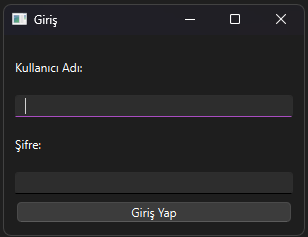
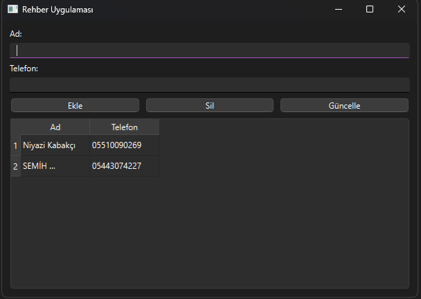

# Proje3
 
Merhaba Masaüstü Rehber Uygulamama Hoşgeldiniz.
 
Masaüstü rehber uygulamam 5 farklı alt başlıktan oluşmaktadır.Kişi ekleme,kişi listeleme,kişi arama,kişi düzenleme,kişi silme uygulamamın alt başlıkları.Masaüstü rehber uygulamam aynı zamanda Mysql ile veritabanı bağlantısına sahip.Bu sayede uygulamamıza eklenen kişilerin bilgilerini veritabınımıza ekleyerek bilgilerin kaydını ve transferini sağlayabiliyoruz.
 
 
Masaüstü Rehber Uygulaması Giriş Ekranı:
 
Uygulamamın Giriş Ekranı Aşağıdaki Şekildedir:
 

 
Masaüstü giriş ekranı bu şekilde.Uygulamanın girişi için, Kullanıcı Adı; "admin"  Şifre: "1234" yazarak uygulamaya giriş yapabilirsiniz.
 
 
Masaüstü Rehber Uygulaması Ana Ekranı:
 
 
Uygulamamın Ana Ekranı Aşağıdaki Şekildedir:
 

 
Masaüstü uygulamasının ana ekranı bu şeklde.Uygulamanın bütün arayüzünü tek sayfada kullandım.Kişleri ekleme,silme,düzenleme ekranlarına kolayca erişebilirsiniz.